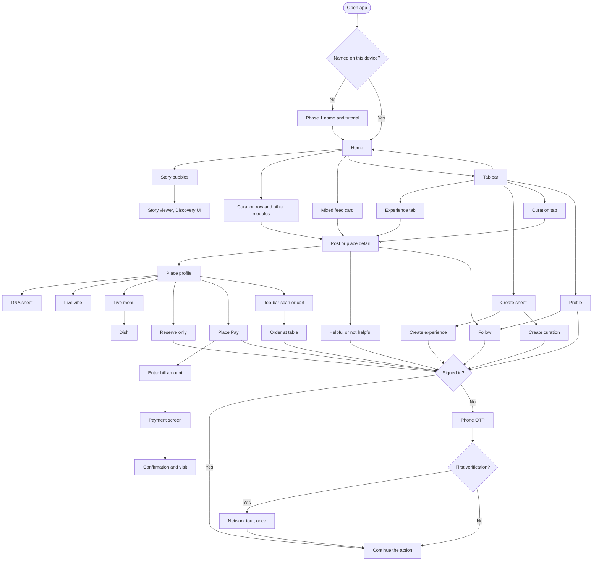

# App map

Guest browsing stays open. An identity action opens the auth gate, then returns to the thing the diner tapped.

Home is a mixed list of experiences, curations, and restaurant stories. A curation row and other filtered modules sit at the top. Those modules come from separate calls with different arguments, not from the mixed list. The app will render the unused brief-module slots later.

Story bubbles open a Discovery-like viewer that can contain curations or restaurant stories, not only experiences.

Place Pay is its own path. Dine-in pay and QSR pay stay separate. Order at table is a deep link or the place top-bar icon, not a Reserve choice.

The diner phone sheet is OTP only. A WhatsApp magic link is the dine-in deep link, not a branch on that sheet.

