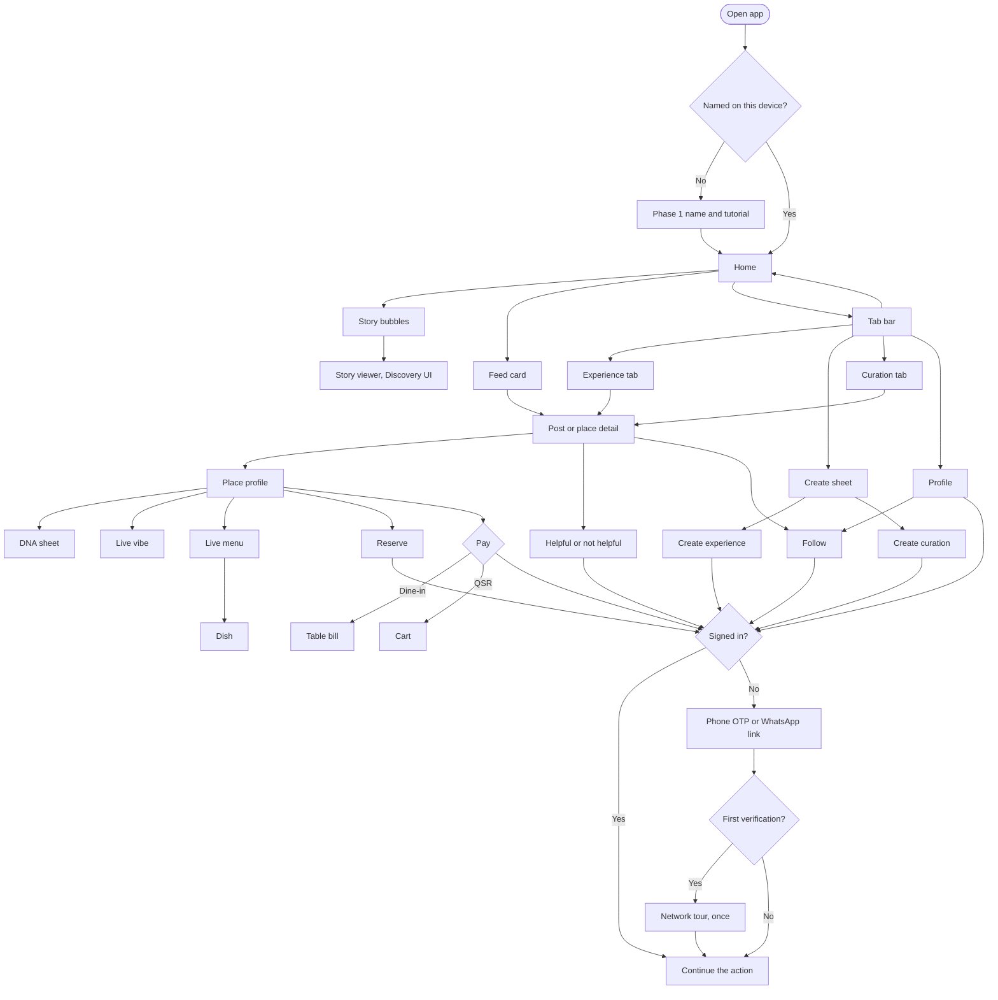

# App map

Guest browsing stays open. An identity action opens the auth gate, then returns to the thing the diner tapped.

```mermaid
flowchart TD
  launch([Open app]) --> known{Named on this device?}
  known -->|No| onboard["Phase 1 name and tutorial"]
  known -->|Yes| home["Home"]
  onboard --> home

  home --> bubbles["Story bubbles"]
  home --> card["Feed card"]
  home --> tabs["Tab bar"]

  bubbles --> viewer["Story viewer, Discovery UI"]
  card --> detail["Post or place detail"]

  tabs --> home
  tabs --> exp["Experience tab"]
  tabs --> create["Create sheet"]
  tabs --> cur["Curation tab"]
  tabs --> profile["Profile"]

  exp --> detail
  cur --> detail
  create --> expFlow["Create experience"]
  create --> curFlow["Create curation"]

  detail --> place["Place profile"]
  place --> dna["DNA sheet"]
  place --> vibe["Live vibe"]
  place --> menu["Live menu"]
  menu --> dish["Dish"]
  place --> reserve["Reserve"]
  place --> pay{"Pay"}
  pay -->|Dine-in| dinePay["Table bill"]
  pay -->|QSR| qsrPay["Cart"]

  detail --> react["Helpful or not helpful"]
  detail --> follow["Follow"]
  profile --> follow

  react --> gate{Signed in?}
  follow --> gate
  expFlow --> gate
  curFlow --> gate
  reserve --> gate
  pay --> gate
  profile --> gate

  gate -->|Yes| back["Continue the action"]
  gate -->|No| auth["Phone OTP or WhatsApp link"]
  auth --> tour{First verification?}
  tour -->|Yes| phase3["Network tour, once"]
  tour -->|No| back
  phase3 --> back
```
