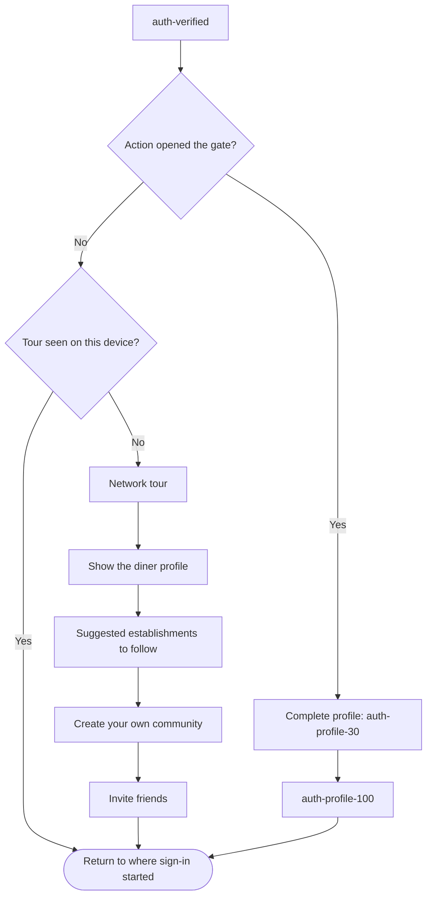

# Onboarding

Phase 1 does not ask for a phone number. The tutorial runs once, before Home. Each tutorial slide in the prototype can skip to Home.

The handle availability check is pending from BE. The handle issue is expected to go away once it ships. Once that check exists, a typed handle that already exists shows "Already have an account? Sign in" on `auth-name`. Until then that CTA is not shown. No path is named for the check.

After Home, the diner is a named guest. Browsing, place profiles, and reading experiences stay open.

## Phase 3, after OTP verification

No screen in the design export covers this tour. The tour-seen flag stays on the device. A reinstall may show the tour again. No server flag.

Superseded 2026-10-01: "Phase 3, after the first successful sign-in" and "It is shown once, not on later logins." The old diagram always opened the tour, with Complete profile as an optional branch off `auth-verified`.

