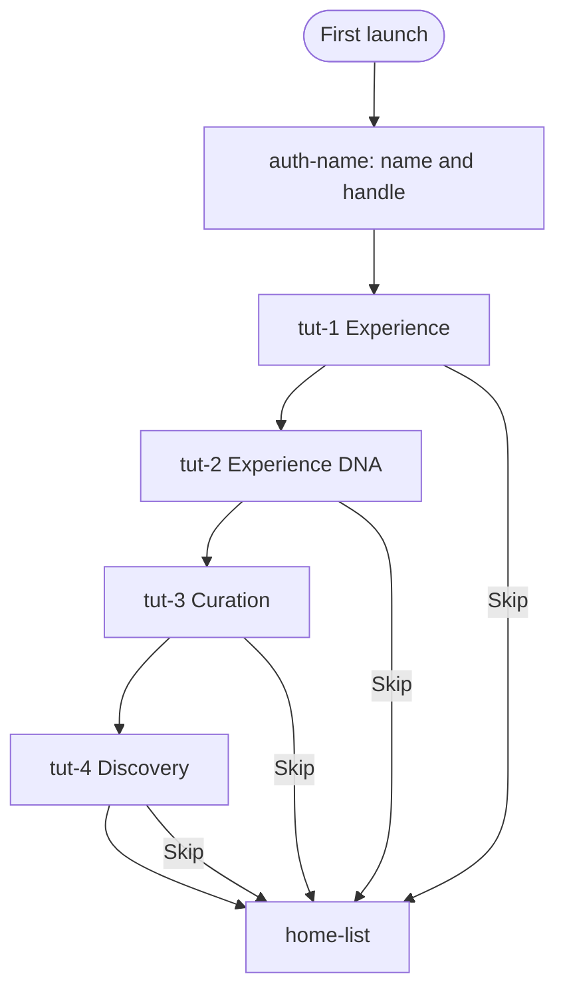
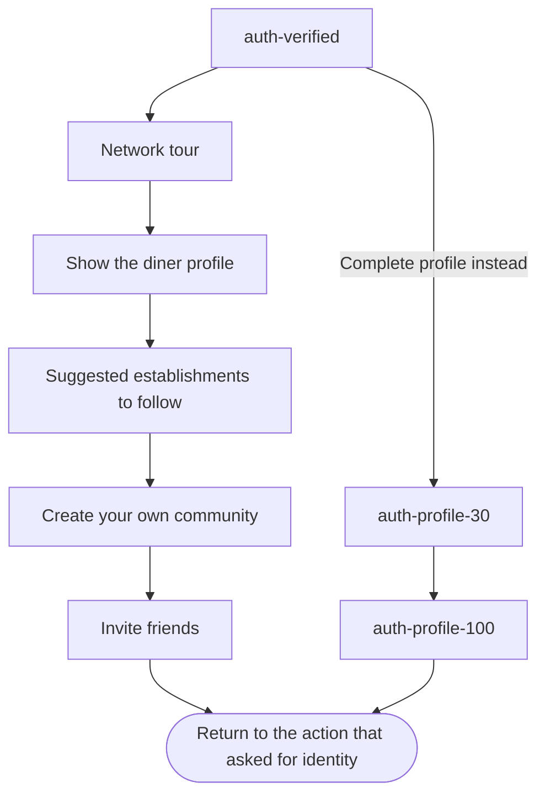

# Onboarding

Phase 1 does not ask for a phone number. The tutorial runs once, before Home. Each tutorial slide in the prototype can skip to Home.

After Home, the diner is a named guest. Browsing, place profiles, and reading experiences stay open.

## Phase 3, after the first successful sign-in

No screen in the design export covers this tour. It is shown once, not on later logins.

