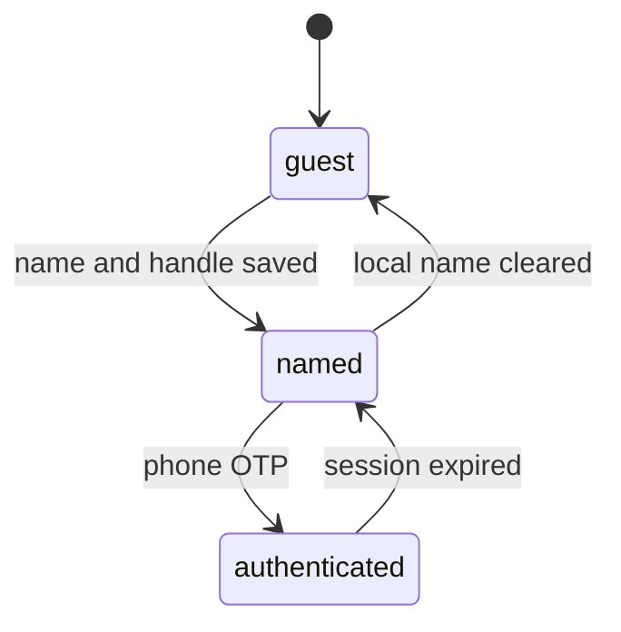

# Auth

Diner sign-in is phone number plus OTP. WhatsApp may deliver that OTP. There is no password. The diner phone sheet does not offer a WhatsApp magic-link branch.

The WhatsApp magic link (`PUT /dd/v1/whatsapp/login`) is the dine-in deep link only. It is not a path off the diner phone sheet.

The gate opens only for an action tied to a person: react, follow, post, reserve, pay, and Profile.

Dine-in WhatsApp login is a separate entry: a table QR or `/wl/wau:<uuid>` link. It never appears as a second button on the diner phone sheet.

`guest` can open the public feed. `named` is phase 1 on this device, still without a JWT. `authenticated` holds the access token and the rotated refresh token in secure storage.
