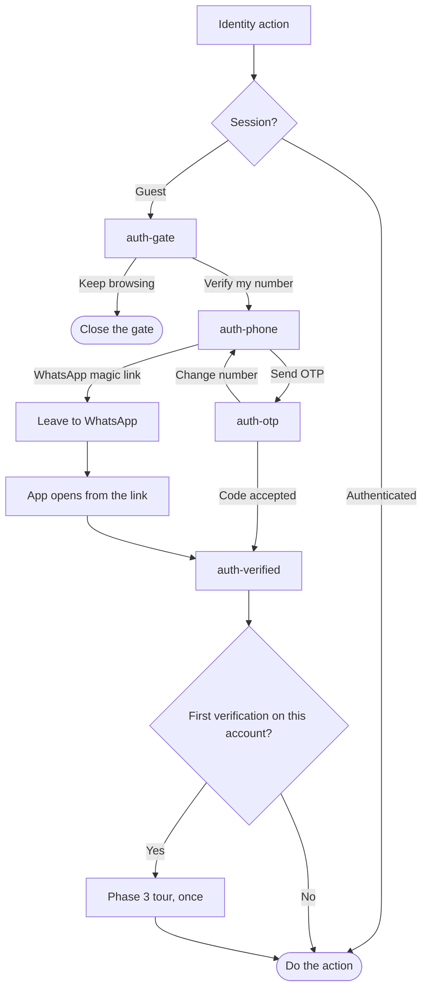
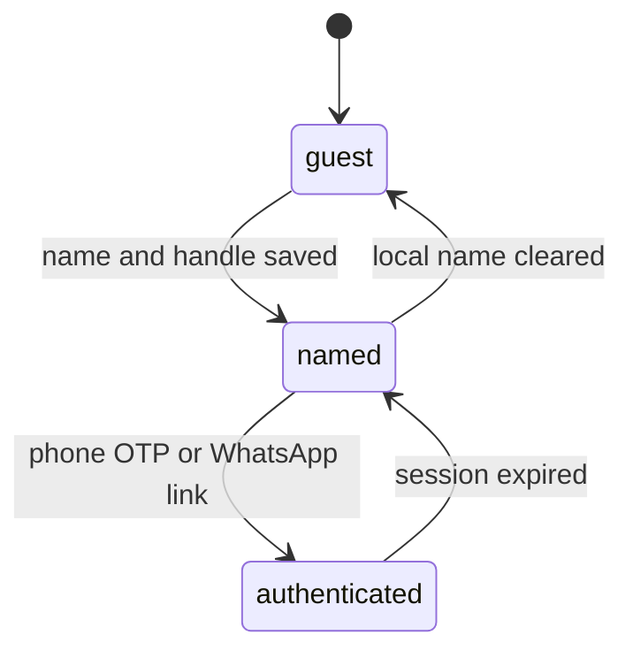

# Auth

Sign-in is phone number plus OTP, or a WhatsApp magic link. There is no password. The gate opens only for an action tied to a person: react, follow, post, reserve, pay, and Profile.

The WhatsApp path has an endpoint (`PUT /dd/v1/whatsapp/login`) and no screen in the export. The diagram does not invent extra screens for it.

`guest` can open the public feed. `named` is phase 1 on this device, still without a JWT. `authenticated` holds the access token and the rotated refresh token in secure storage.
