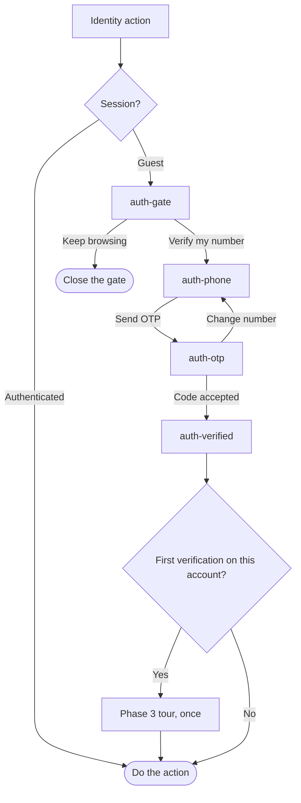
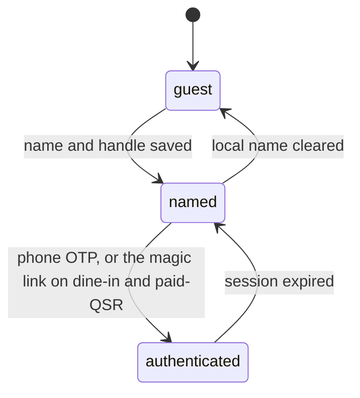

# Auth

General diner sign-in is phone number plus OTP. WhatsApp may deliver that OTP. There is no password. The diner phone sheet does not offer a WhatsApp magic-link branch.

The WhatsApp magic link (`PUT /dd/v1/whatsapp/login`) is a sign-in method. It is the forced (preferred) sign-in for dine-in and paid-QSR, so BE can use WhatsApp's customer-service window to message the user on WhatsApp. It is not a path off the diner phone sheet.

The OTP is 6 digits for now. That length is the current value from the OTP provider and may change, so clients must not hard-code it.

The gate opens only for an action tied to a person: react, follow, post, reserve, pay, and Live Vibe. Live Menu is open to guests. The gate opens as a sheet over the screen the diner was on, and tapping outside it keeps browsing. The basic user profile view is not gated, but any private information or analytics on the profile is gated behind sign-in.

Dine-in and paid-QSR use that magic link as the forced (preferred) sign-in. Dine-in entry is a table QR or `/wl/wau:<uuid>` link. It never appears as a second button on the diner phone sheet. TODO: no paid-QSR magic-link entry path is captured, so this note does not name one.

`guest` can open the public feed. `named` is phase 1 on this device, still without a JWT. `authenticated` holds the access token and the rotated refresh token in secure storage.
