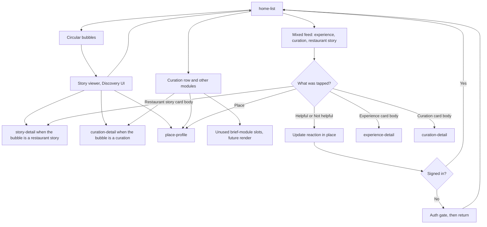

# Home

Home is one mixed list of three post types: experience, curation, and restaurant story. Helpful and Not helpful act on the card and do not open detail. Every other tap on a card opens detail.

At the top there is a curation row and other filtered modules (highlights, followed experiences, brand curation suggestions, place suggestions, brand promotions). Those modules come from separate calls with different arguments, not from the mixed list. The app will render unused brief-module slots in a later pass. They stay in this diagram.

The circular bubbles at the top open a Discovery-like story viewer. That viewer can contain curations or restaurant stories, not only experiences. Discovery is not a tab and not a separate feed.

Empty, offline, and error states stay on Home. They do not swap in demo cards.

The brand-promotions slot, once rendered, opens the same place, offer, or brand curation as a WhatsApp promotion.
