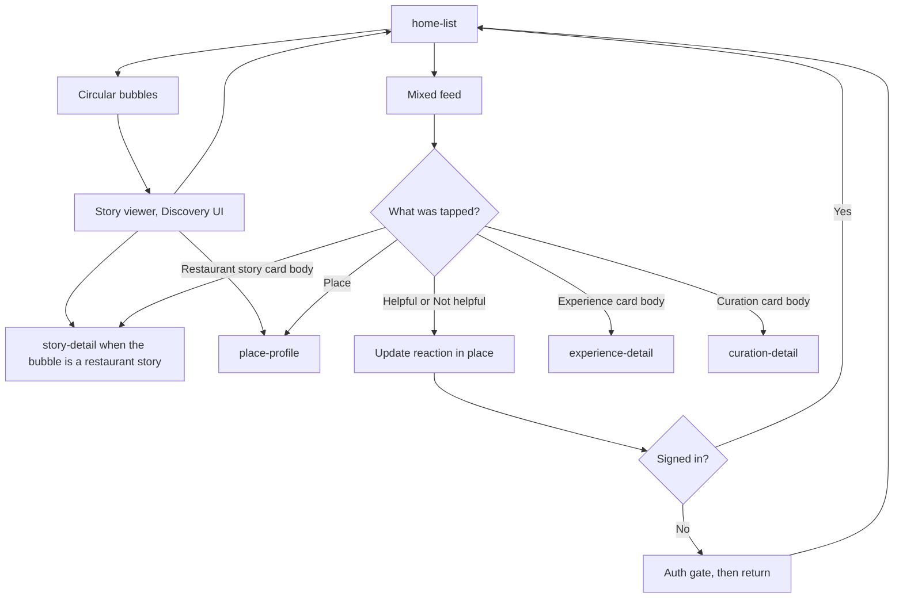

# Home

Home is one list of experiences, curations, and restaurant stories. Helpful and Not helpful act on the card and do not open detail. Every other tap on a card opens detail.

The circular bubbles at the top open the story viewer. That viewer is the Discovery UI. Discovery is not a tab and not a separate feed.

Empty, offline, and error states stay on Home. They do not swap in demo cards.

Modules named in the brief (highlights, followed experiences, brand curation suggestions, place suggestions, brand promotions) are slots in this list. The export does not show them as separate screens. The brand-promotions slot opens the same place, offer, or brand curation as a WhatsApp promotion.
