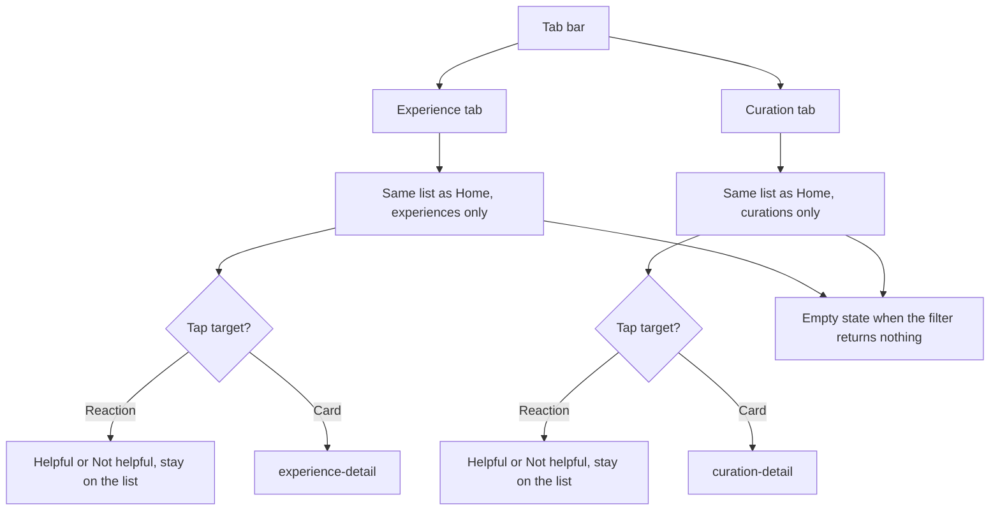

# Experience and Curation tabs

Both tabs use the Home list. The only difference is the post type filter.

The prototype screen `curation-feed` is not the Curation tab. The tab is the filtered Home list. `curation-feed` is export-only and not a product destination.
