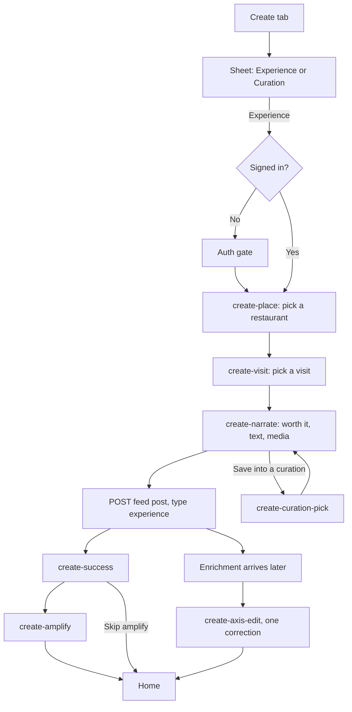

# Create an experience

Create on the tab bar is a sheet, not a screen. One choice is "create Experience". Posting requires a signed-in diner.

Worth it is a boolean on the experience. It is not the Helpful reaction.

A verified experience is one tied to a real visit and order. If the diner has no visit, the post is still allowed and stays unverified. Dish tags from the bill appear only when the visit is verified. There is no captured sample of that dish payload.

`create-axis-edit` edits inferred axes on the experience. It does not show restaurant DNA.
