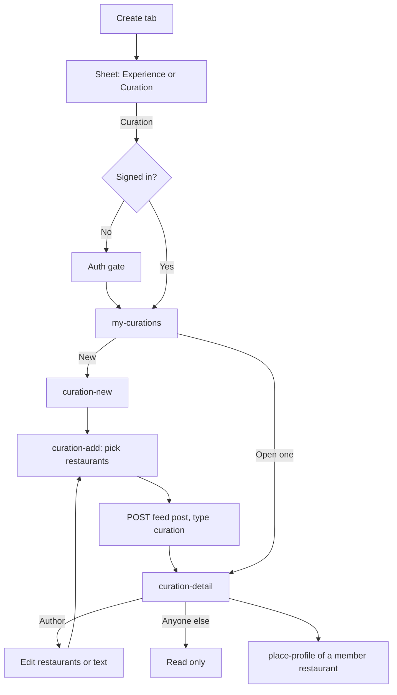

# Curation

A curation is a post of type curation: a list of restaurants, with a required caption, an optional cover, and an optional body. The title is the post title, not a field inside the curation payload. Brand curations are the same shape from a brand or restaurant author, and they are promoted in the feed. The capture has no `promoted` field yet.

From an experience, `create-curation-pick` adds that place to an existing curation or starts one. Delete and edit on the curation show only for the author.
