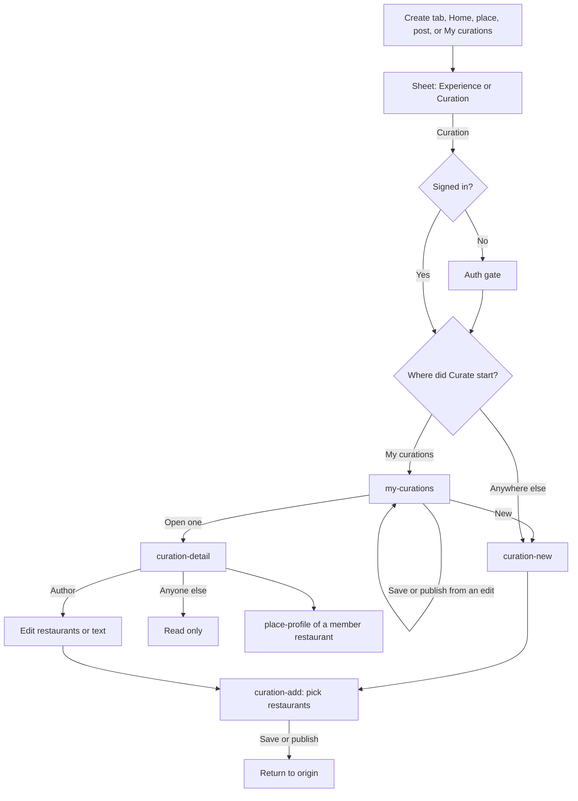

# Curation

A curation is a post of type curation: a list of restaurants, with a required caption, an optional cover, and an optional body. The title is the post title, not a field inside the curation payload. Brand curations are the same shape from a brand or restaurant author, and they are promoted in the feed. The capture has no `promoted` field yet.

Create, publish, and save return to the screen where Curate was started (place, feed, post, Create tab, Home). The navigation stack is the origin. If the diner started from My curations, staying there is correct. They do not always land on My curations, and they do not always land on curation-detail.

From an experience, `create-curation-pick` adds that place to an existing curation or starts one, then returns to that experience. Delete and edit on the curation show only for the author.
