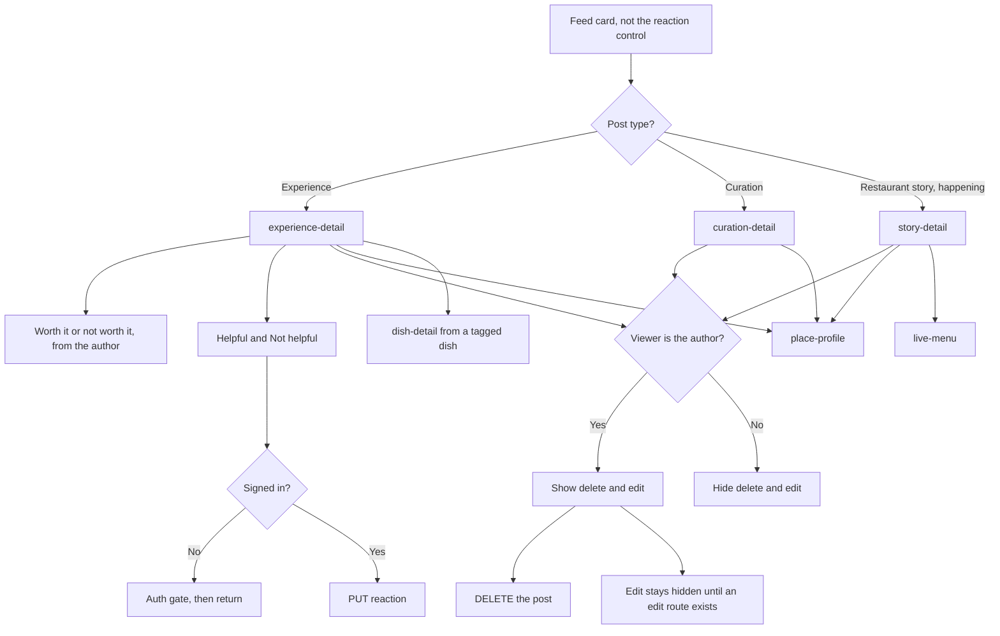

# Post detail

Three detail screens. Helpful and Not helpful are on experiences. Worth it belongs to the experience payload, not to the reaction row. A restaurant story does not carry worth it.

DNA is not drawn on an experience. The pre-audit export still links a DNA gem from `experience-detail`. The product rule is restaurant-only.

Not helpful is shown in the product. The wire value `FEED_POST_REACTION_UNHELPFUL` is not confirmed in a capture. `FEED_POST_REACTION_INVALID` means there is no viewer. It is not a third button.
