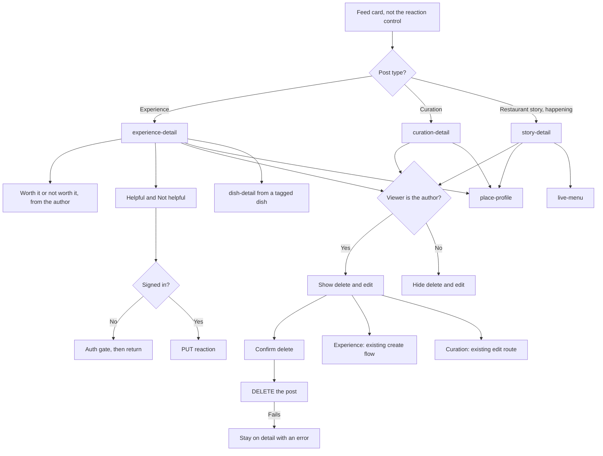

# Post detail

Three detail screens. Helpful and Not helpful are on experiences. Worth it belongs to the experience payload, not to the reaction row. A restaurant story does not carry worth it.

DNA is not drawn on an experience. The pre-audit export still links a DNA gem from `experience-detail`. The product rule is restaurant-only.

Not helpful is shown in the product. The wire value is `FEED_POST_REACTION_UNHELPFUL`. `FEED_POST_REACTION_INVALID` means there is no viewer. It is not a third button.

Delete is `DELETE /v1/feed_posts/{uuid}` and is wired for the author. Guests and other diners do not see it. Edit on a curation opens the existing curation editor. Edit on an experience reuses the create-experience flow; there is still no captured `PUT /v1/feed_posts/{uuid}` to persist an in-place edit.
