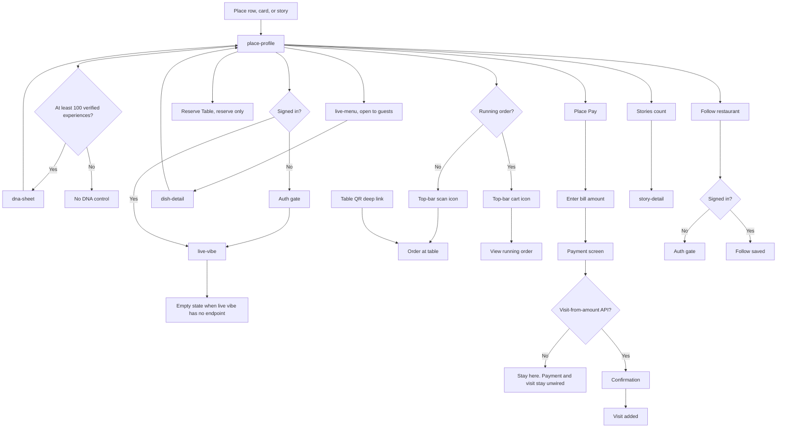

# Place

Place profile is open to guests. Live Menu is open to guests. Live Vibe needs sign-in. Reserve, Place Pay, and order-at-table ask for identity. DNA opens only when the restaurant has more than 100 verified experiences. Below that, the sheet is not offered.

Place Pay is a different flow from dine-in pay and from QSR pay. Do not collapse them.

Reserve Table shows only the reserve option. Order-at-table is not a choice on that entry.

Order at table starts from a table-QR deep link, or from the top-right icon on the place screen: a scan icon when there is no running order, a cart icon when there is (opens the running order). That dine-in sign-in is the WhatsApp magic link.

Live vibe is one of the three core purposes. No live-vibe endpoint is in the captured lists, so the screen stays an empty state rather than demo content.

No captured diner-app API creates a visit from a typed bill amount. Place Pay is implemented through amount entry and a payment screen. It does not call dine-in pay, does not fake a successful payment, and does not add a visit until that API exists.
