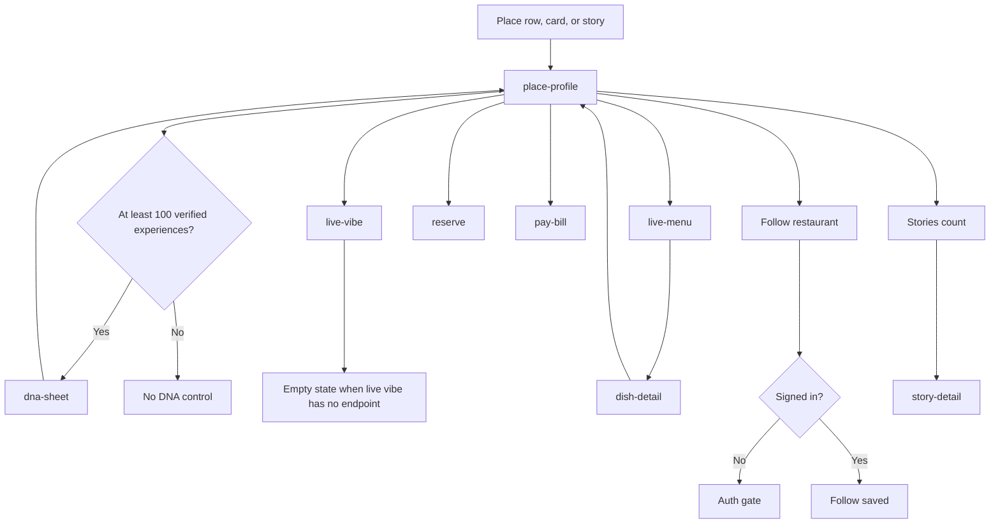

# Place

Place profile is open to guests. Reserve and pay ask for identity. DNA opens only when the restaurant has more than 100 verified experiences. Below that, the sheet is not offered.

Live vibe is one of the three core purposes. No live-vibe endpoint is in the captured lists, so the screen stays an empty state rather than demo content.
