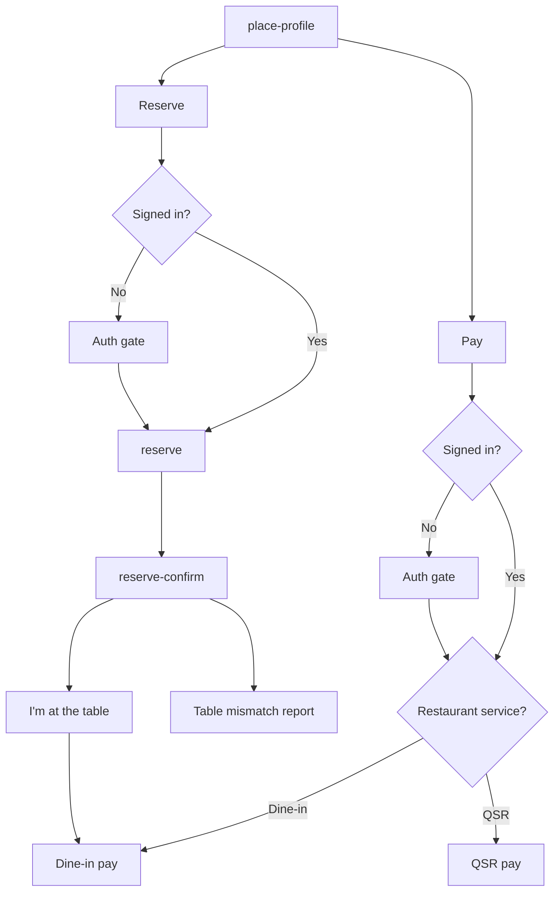

# Reserve, and which pay path

Reserve and pay both start from a place, and both need a signed-in diner. Pay then splits by service. Dine-in is a table bill. QSR is a cart.

Reserve has no captured endpoint. The two pay paths are [dine-in](./11-dine-in-pay.md) and [QSR](./12-qsr-pay.md). A failed payment stays on the bill or the cart. It does not show a receipt.
