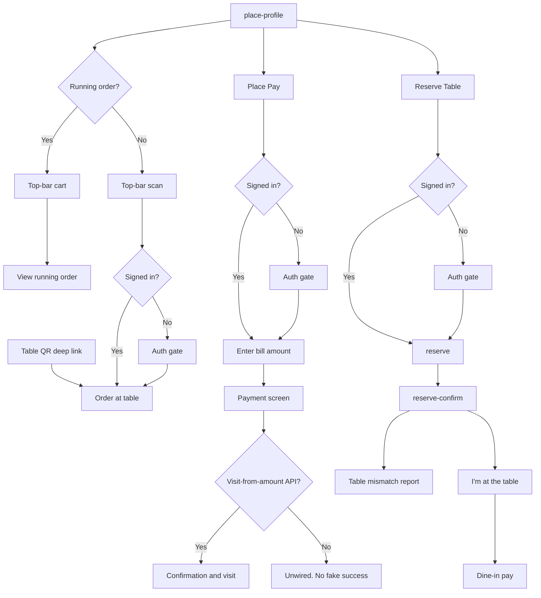

# Reserve, Place Pay, and order at table

Reserve, Place Pay, and order-at-table all start from a place, and all need a signed-in diner. They stay three different paths.

Reserve Table shows only reserve. Order-at-table is not a choice on that entry.

Place Pay is not dine-in pay and not QSR pay: the diner types a bill amount, then a payment screen, then confirmation, and a visit is added.

Order at table is a table-QR deep link, or the place top-bar icon (scan when there is no running order, cart when there is).

Reserve has no captured endpoint. Place Pay does not share a path with [dine-in](./11-dine-in-pay.md) or [QSR](./12-qsr-pay.md). A failed payment stays on the bill, the cart, or the Place Pay amount screen. It does not show a receipt.
