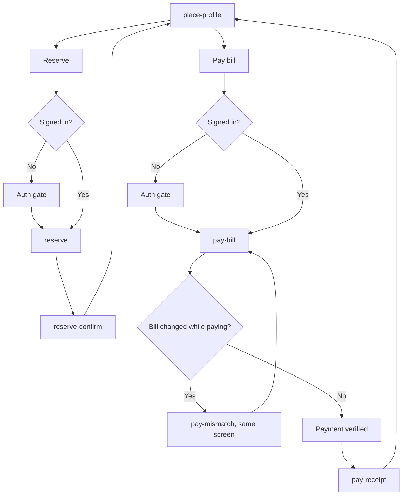

# Reserve and pay

Both start from a place and both need a signed-in diner. Guests hit the auth gate and come back to the same step.

Reserve has no captured endpoint. Pay uses the stage payment init and verify routes from dine-in `main`. If either call fails, the screen stays on the bill with an error state, not a fake receipt.
