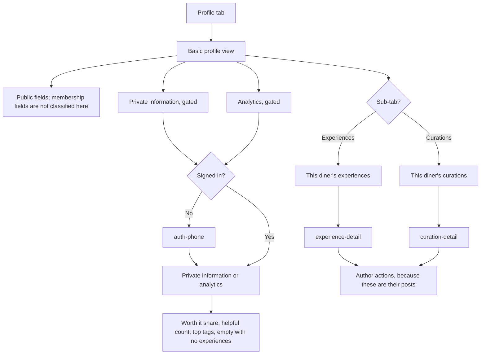

# Profile, follow, and block

The basic user profile view is not gated, but any private information or analytics on the profile is gated behind sign-in. This note does not decide which fields count as private.

A guest who opens the tab sees the basic profile. "Verify my number" opens `auth-phone` for the gated parts. Analysis is analytics: the share they called Worth it, how many diners found them helpful, and their most frequent tags. With no experiences it is an empty state. Analysis is gated.



Follow and block are identity actions. Follow can target a restaurant, a diner, or a brand. Block is diner to diner.

```mermaid
flowchart TD
  from["Profile, place, or author row"] --> choice{Action?}
  choice -->|Follow| fgate{Signed in?}
  choice -->|Unfollow| fgate
  choice -->|Block| fgate
  fgate -->|No| auth["Auth gate"]
  auth --> call
  fgate -->|Yes| call["Follow, unfollow, or block request"]
  call --> done["Row updates in place"]
```

Another diner's public profile, and a list of posts by author, are not in the captured endpoints. Tapping someone else stops at an empty state until those exist. The Profile tab itself is this diner's own profile, built from system components. It was not in the design export.
