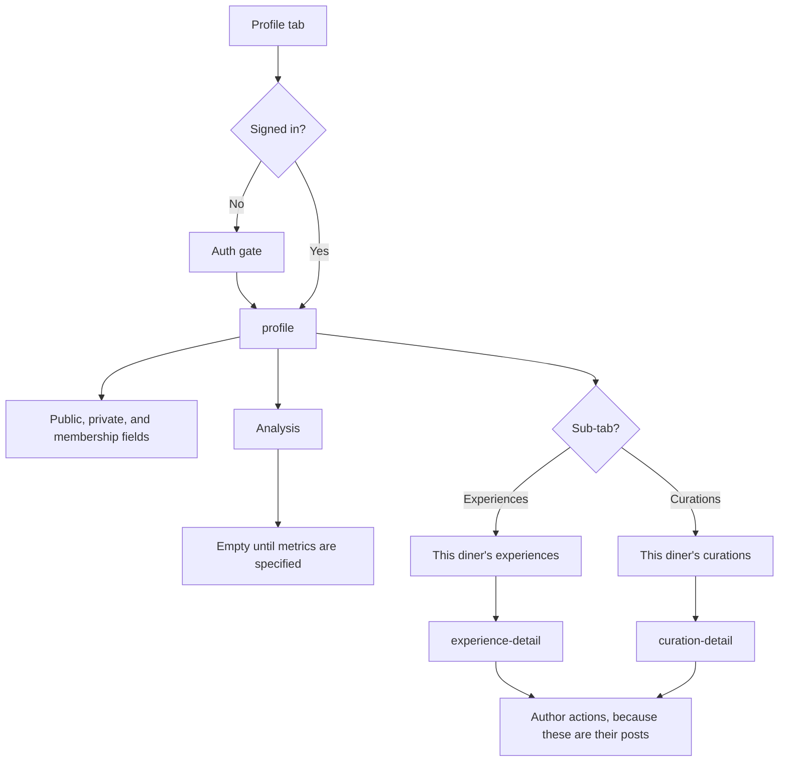

# Profile, follow, and block

Profile is the signed-in diner. A guest who opens the tab gets the auth gate. Analysis metrics are not specified yet, so that area is an empty state.



Follow and block are identity actions. Follow can target a restaurant, a diner, or a brand. Block is diner to diner.

```mermaid
flowchart TD
  from["Profile, place, or author row"] --> choice{Action?}
  choice -->|Follow| fgate{Signed in?}
  choice -->|Unfollow| fgate
  choice -->|Block| fgate
  fgate -->|No| auth["Auth gate"]
  auth --> call
  fgate -->|Yes| call["Follow, unfollow, or block request"]
  call --> done["Row updates in place"]
```

Another diner's public profile, and a list of posts by author, are not in the captured endpoints. Tapping someone else stops at an empty state until those exist. The Profile tab itself is this diner's own profile, built from system components. It was not in the design export.
