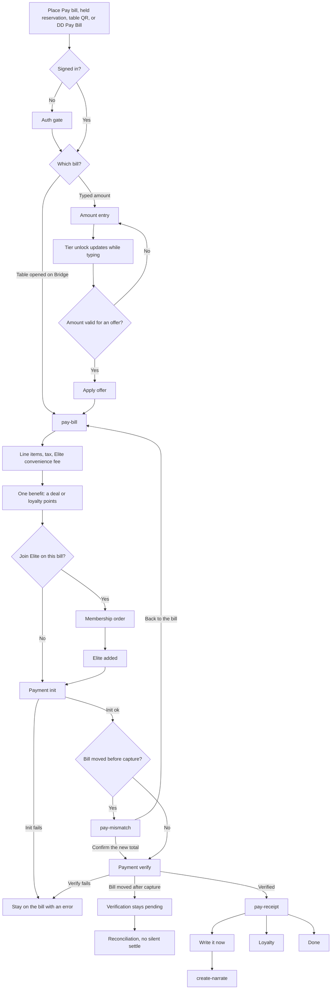

# Dine-in pay

Dine-in is a table session. Staff open the bill on Bridge, and the diner pays that running bill. Digital Dining also has an amount-entry path: the diner types what to pay, and the tier unlock moves while they type. A waiter can still add items, so the total can change during pay.

This is not the QSR cart. Packaging charges belong to QSR.

`pay-bill`, `pay-mismatch`, and `pay-receipt` are the exported screens. Amount entry, the tier stepper, Apply Offer, and Join Elite are in the July Digital Dining frames and have no Claude Design screen id.

The itemized bill is `GET /dd/v1/orders/{orderId}/invoice`. Pay is `…/payments/appsdk/init` then `…/payments/sdk/verify`. Membership uses `elite_membership_orders` create, init, and verify. No request body for that membership order is captured.

On the bill, a deal and loyalty points cannot be combined. Tokens cannot pay a restaurant bill. The receipt moves three ledgers separately: the restaurant's points, Elite tokens, and the spent deal. A failed init or verify stays on the bill. Nothing is charged when the mismatch sheet appears before capture.
