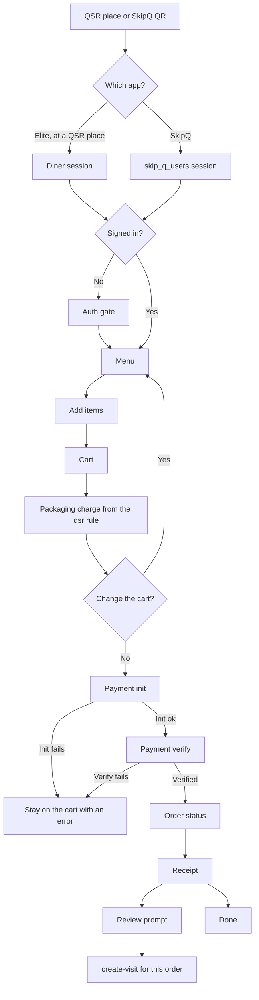

# QSR pay

QSR is counter service. The restaurant `qsr` config names a floor area and a packaging-charge rule: an upper limit, a fixed amount, or no limit. The diner builds a cart and pays that cart. There is no Bridge table session, so a waiter cannot add an item while payment is in progress, and the dine-in mismatch sheet does not apply.

SkipQ is the QSR app on the same gateway (`skip_q_routes.go`). Its session is a `skip_q_users` identity, not a diner user. The Claude Design export has no SkipQ, cart, or order-status screen.

Order status uses the QSR status gradient. The status names are not in the captured docs. SkipQ payment routes are not in the captured endpoint list. The only written payment routes are the dine-in init and verify paths, and those are table-order routes.

Digital Dining's cart chrome (Add, quantity, View Cart) is the cart this flow uses. Reorder lands back on this cart when the restaurant is QSR.
