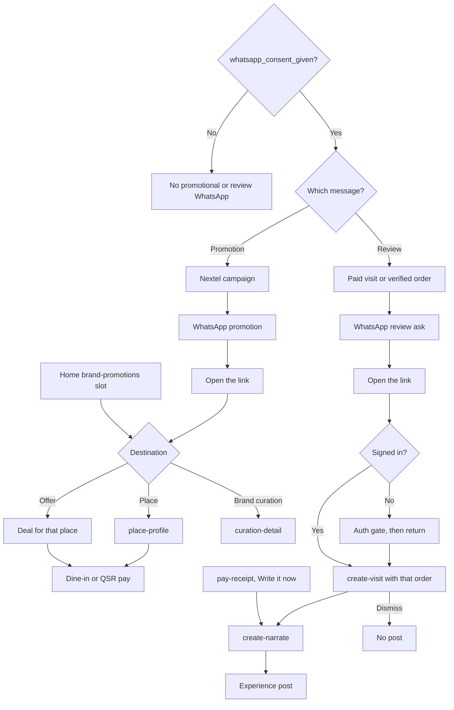

# WhatsApp promotion and review

Promotion and review are separate from sign-in. Diner sign-in is a phone OTP, which can be delivered on WhatsApp. The magic link `PUT /dd/v1/whatsapp/login` is the dine-in deep link only, not a branch on the diner phone sheet. A promotion or a review message sends only when `whatsapp_consent_given` is true. Campaign send is the Nextel refresh worker on the catalog service. No message template and no deep-link contract are captured.

The Home brand-promotions slot is the same offer inside the app, so a promotion does not require WhatsApp. The receipt already asks the diner to write the visit, so a review does not require WhatsApp. The WhatsApp link opens that same destination from outside. With consent off, only the in-app slot and the receipt prompt remain.
