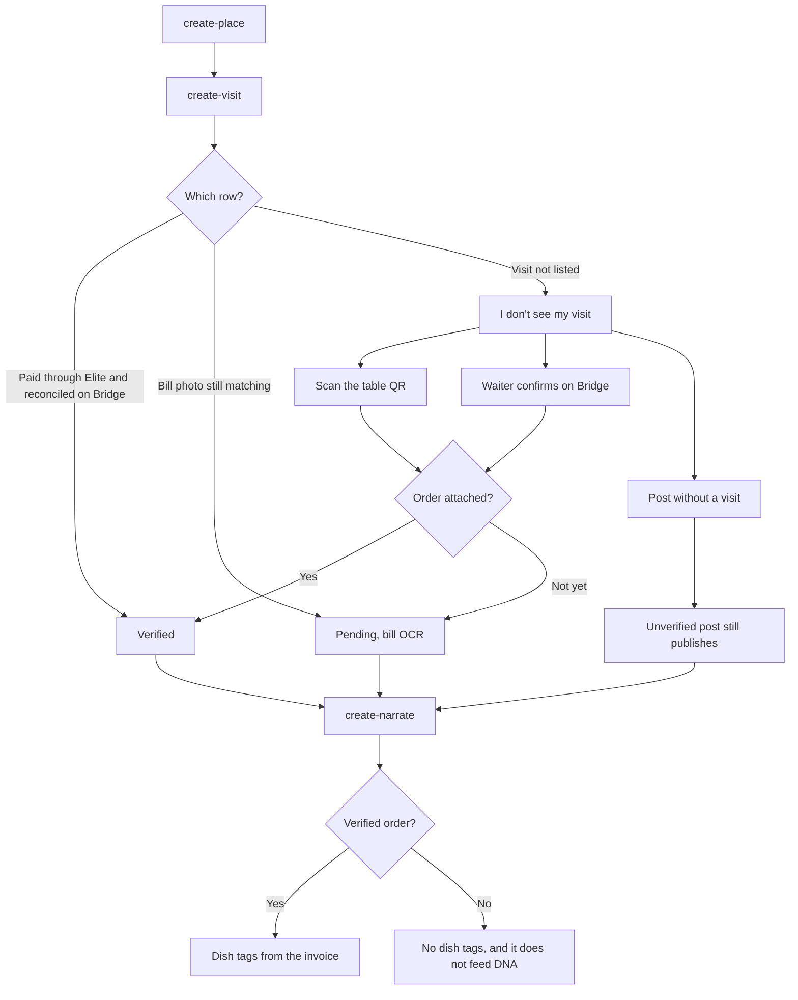

# Visit verification

A verified experience is tied to a real visit and order. `create-visit` shows three states. The ways to attach a missing visit have no screen of their own.

The visit list is `PUT /dd/v1/users/orders/histories`. Dish lines are `GET /dd/v1/orders/{orderId}/invoice`. Every captured experience still has an empty `visit_id` and `order_id`. An unverified post is allowed. It does not feed restaurant DNA and it does not auto-tag dishes.
