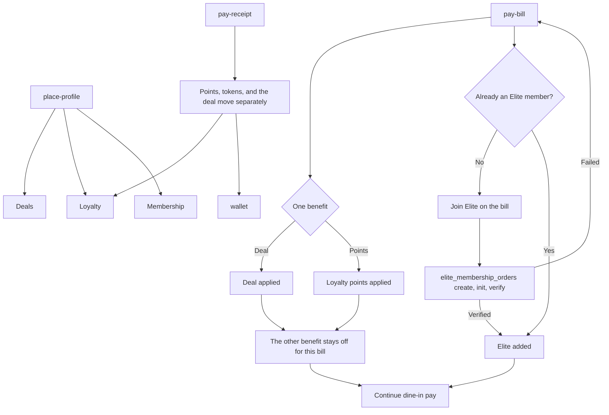

# Membership, deals, and loyalty

A dine-in bill can take one benefit, and it can sell Elite membership before pay. Deals, loyalty, and membership are linked from the place and the receipt. None of those three screens was exported. The token wallet is a different ledger and does have a screen.

Membership purchase is the gateway's `elite_membership_orders` create, init, and verify. No request body is captured. Profile already shows `elite_membership` and `restaurant_memberships`. Deals and loyalty have no captured read or redeem route, so those screens stay empty until they do.
