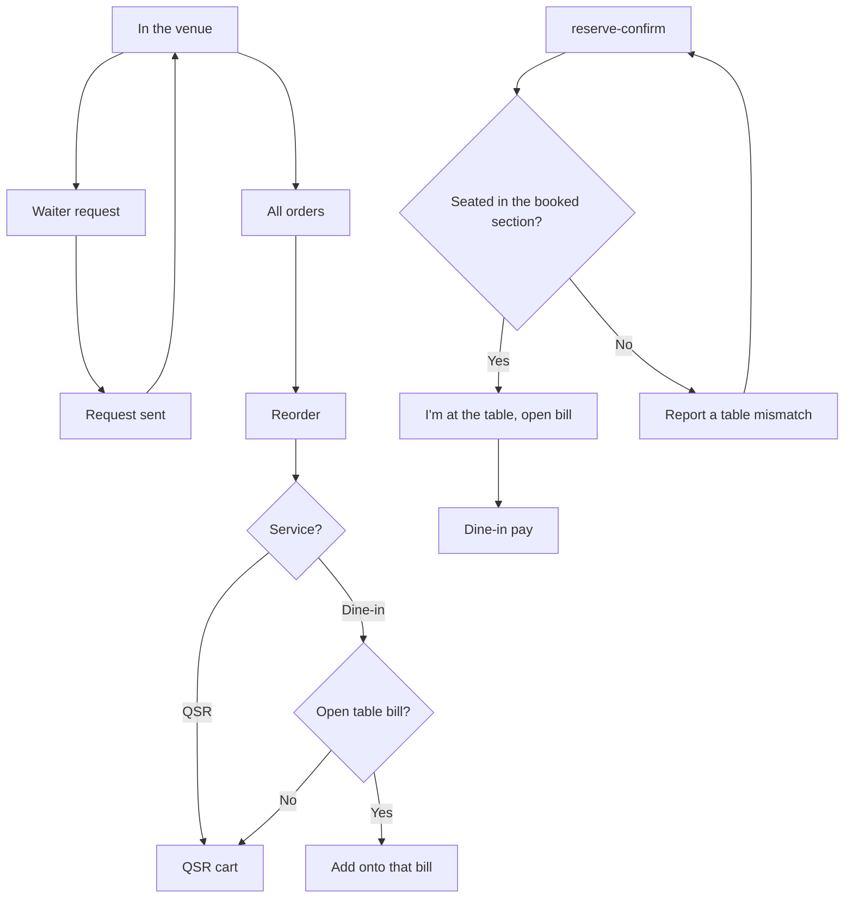

# Waiter, reorder, and table mismatch

Digital Dining's in-venue bar is Home, Menu, Re-order or All Orders, Pay Bill, and Waiter Req. Pay is the dine-in or QSR diagram. These three are the rest. None has a Claude Design screen, and none has a captured endpoint.

A held table lasts 30 minutes past the slot. Parties above 6 are confirmed by the outlet rather than held automatically. A terrace hold can take an advance that is adjusted against the bill. Those rules sit on `reserve` and `reserve-confirm`. The report action on the held screen has nowhere to submit yet.
